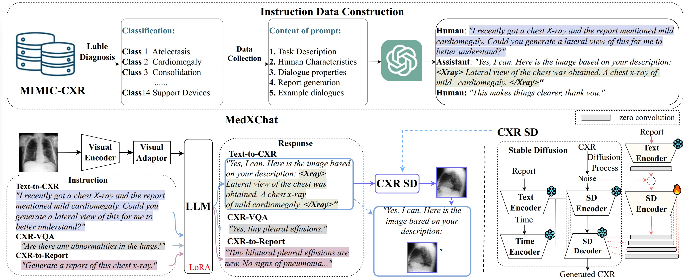
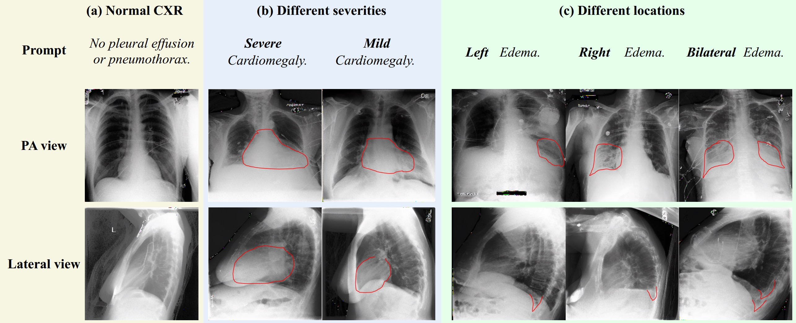

# MedXChat: A Unified Multimodal Large Language Model Framework towards CXRs Understanding and Generation
##### ISBI 2025

[**MedXChat: A Unified Multimodal Large Language Model Framework towards CXRs Understanding and Generation**]

[Ling Yang](https://scholar.google.com/citations?user=0x4eX9cAAAAJ&hl=zh-CN),
[Zhanyu Wang](https://scholar.google.com/citations?hl=zh-CN&user=maeFb38AAAAJ),
[Zhenghao Chen](https://scholar.google.com/citations?hl=zh-CN&user=BThVCu8AAAAJ),
Xinyu Liang,
[Luping Zhou](https://scholar.google.com/citations?user=BThVCu8AAAAJ&hl=zh-CN&oi=ao)<br/>






## Requirements
A suitable [conda](https://conda.io/) environment named `medxchat` can be created
and activated with:

```
conda create -n medxchat python=3.9
conda activate medxchat
conda install pytorch==2.4.1 torchvision torchaudio pytorch-cuda=12.1 -c pytorch -c nvidia
pip install -r requirements.txt
```
